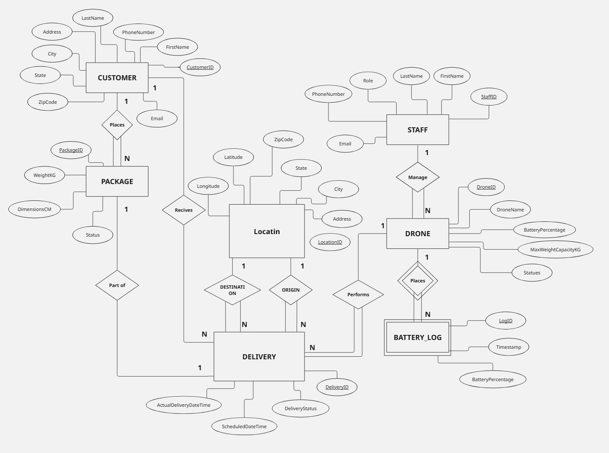

# 🚁 Drone Delivery Management System

A professional desktop application for managing warehouse drone operations, deliveries, customers, packages, and battery tracking.  
Built using Python (Tkinter) and Microsoft SQL Server.

---

# 🎯 Features

## 📊 Dashboard
- Real-time system statistics
- Total drones, deliveries, customers, and packages
- Battery monitoring overview
- System status summary

---

## 🚁 Drone Management
- Add new drones
- Update drone information
- Delete drones
- Track battery percentage ⚡
- Monitor status (Available / Delivering / Charging / Maintenance)

---

## 👤 Customer Management
- Add / Update / Delete customers
- Store contact details
- Manage delivery addresses

---

## 📦 Package Management
- Track package weight and dimensions
- Monitor delivery status
- Link packages to customers

---

## 🚚 Delivery Management
- Assign drones to deliveries
- Track delivery status in real time
- Schedule deliveries
- Monitor completion time

---

## 📍 Location Management
- Store origin & destination locations
- Latitude & Longitude support 🌍
- Geographical tracking

---

## ⚡ Battery Logs
- Track drone battery history over time
- Timestamp-based logging
- Monitor battery consumption trends

---

## 🔎 Search & Filter
- Search across all tables
- Filter records dynamically
- Quick data access

---

## 💾 Export Data
- Export tables to CSV format
- Backup and reporting support

---

# 🛠️ Technologies Used

- Microsoft SQL Server  
- Python  
- Tkinter (GUI)  
- pyodbc  
- CSV Module  

---

# 🧱 Database Schema

## Main Tables
- Staff
- Drone
- Customer
- Package
- Delivery
- Location
- BatteryLog  

---

# 📊 ER Diagram



---


# ▶️ How to Run

## 1️⃣ Setup Database
```sql
Run: database/DroneDelivery.sql
Run: database/sample-data.sql
